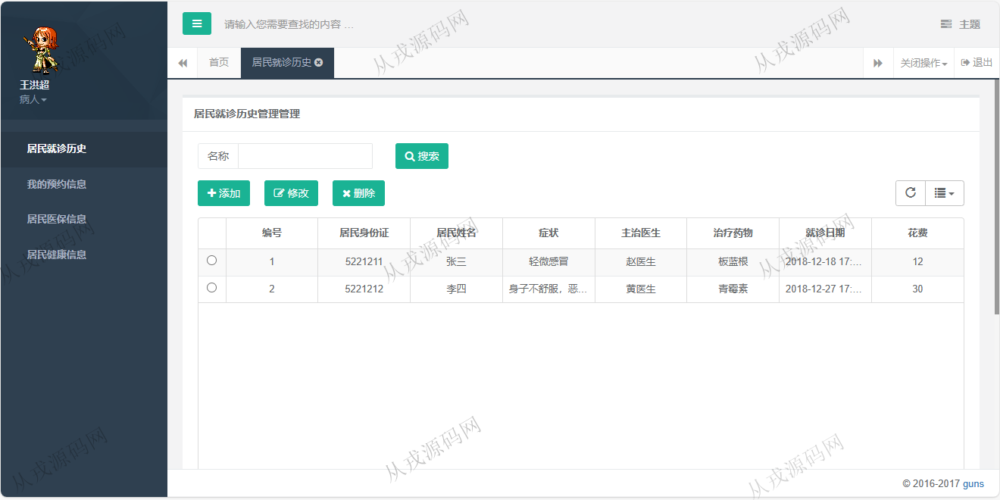
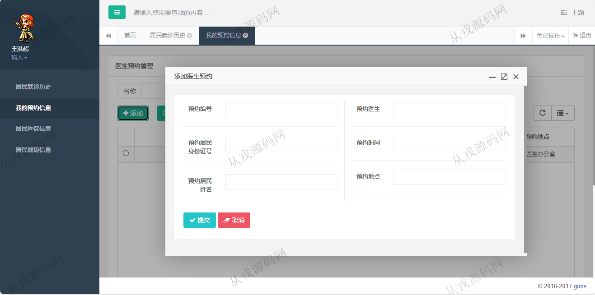
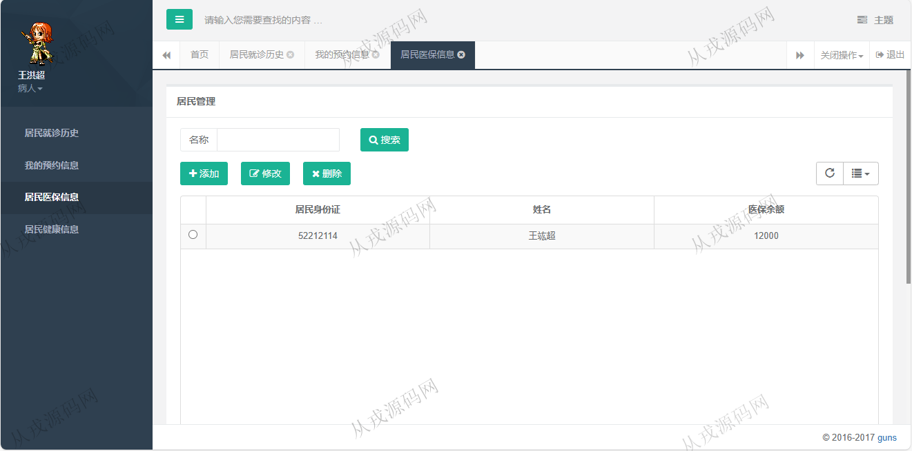
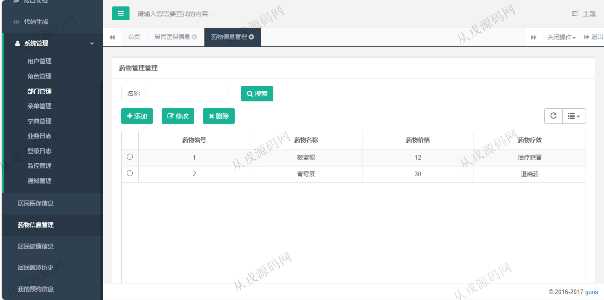
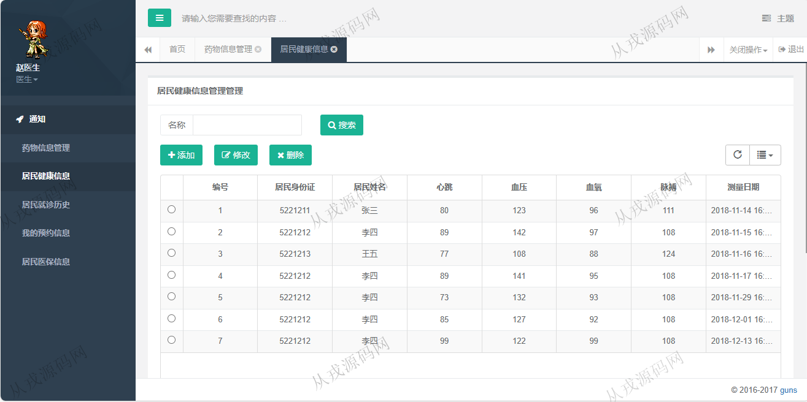
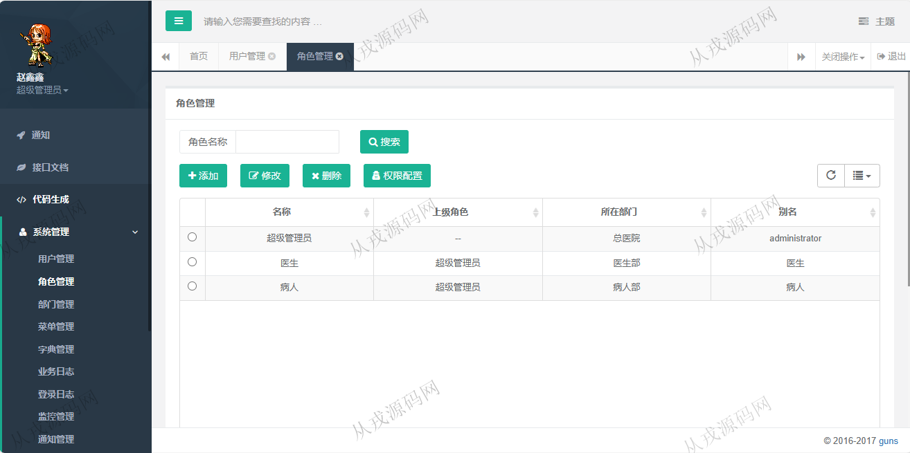
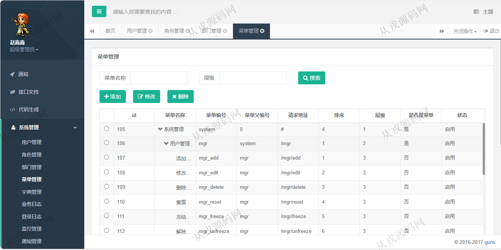

<h1 align="center">115.社区养老医疗综合服务平台</h1>

- <b>完整代码获取地址：从戎源码网 ([https://armycodes.com/](https://armycodes.com/))</b>
- <b>技术探讨、资料分享，请加QQ群：692619798</b> 
- <b>作者微信：19941326836  QQ：952045282</b> 
- <b>承接计算机毕业设计、Java毕业设计、Python毕业设计、深度学习、机器学习</b>
- <b>选题+开题报告+任务书+程序定制+安装调试+论文+答辩ppt 一条龙服务</b>
- <b>所有选题地址 ([https://github.com/YuLin-Coder/AllProjectCatalog](https://github.com/YuLin-Coder/AllProjectCatalog)) </b>

## 项目介绍
基于springboot的社区养老医疗综合服务平台：前端 html、jquery，后端 maven、springmvc、spring、mybatis、shiro，角色分为管理员、医生、患者；集成居民就诊，预约，居民医保，居民健康信息等功能于一体的系统。

## 功能介绍

### 管理员

- 用户管理：用户信息的增删改查
- 角色管理：角色信息的增删改查，权限配置
- 菜单管理：菜单信息的增删改查，树形结构展示
- 居民医保信息：管理员可以查询所有用户的医保信息
- 药物信息管理：药物信息的增删改查
- 居民健康信息：管理员可以查询所有居民的健康信息，心跳、血压、血氧等
- 居民就诊历史：就诊信息的增删改查

### 医生

- 居民医保信息：医生可以查询所有用户的医保信息
- 药物信息管理：药物信息的增删改查
- 居民健康信息：医生可以查询所有居民的健康信息，心跳、血压、血氧等
- 居民就诊历史：就诊信息的增删改查

### 患者

- 我的预约信息：预约信息的增删改查，预约时需要指定医生、时间、地点
- 居民医保信息：医保信息列表查询
- 居民健康信息：健康信息，心跳、血压、血氧等
- 居民就诊历史：就诊信息的增删改查

## 环境

- <b>IntelliJ IDEA 2021.3</b>

- <b>Mysql 5.7.26</b>

- <b>JDK 1.8</b>

## 运行截图

